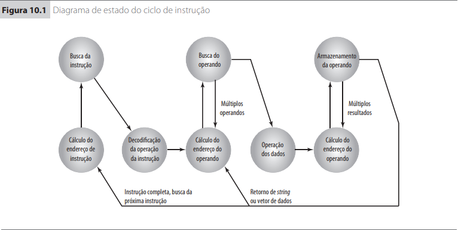

# Conjunto de instruções

**1. O que é um Conjunto de Instruções?**

Um conjunto completo dos operadores das instruções de um computador, junto com uma descrição dos tipos de significados que podem ser atribuídos aos seus operandos. Sinônimo de conjunto de instruções de máquina.

**2. Cite e explique quais são os elementos de uma instrução.**

* Código da operação (opcode):
	* Especifica a operação a ser realizada.
* Referência ao operando fonte.
	* Especifica o operando fonte da operação a ser realizada
* Referência ao operando destino.
	* Especifica onde ficará armazenada o resultado da operação
* Referência a próxima instrução.

**3. Desenhe o diagrama de estado do Ciclo de Instrução. Porque existem as fases de cálculo de endereço do operando e cálculo de endereço do resultado?**



* É necessário o cálculo de endereço do operando se a operação envolvida referência a um operando na memória ou dispositivo via E/S.
* Cálculo de endereço de resultado é necessário para armazenar o resultado ou enviar a um dispositivo de E/S.

**4. Cite e explique os tipos de instrução que podem existir em um conjunto de instruções.**

* Processamento de dados: operações aritméticas e lógicas.
* Armazenamento de dados: movimentação de dados entre registradores e memória principal.
* Movimentação de dados para E/S: instruções para realização de operações de E/S.
* Controle de fluxo: instruções de teste e desvio. 

**5. Quantos endereços podem existir em uma instrução? Exemplifique sua resposta.**

A quantidade de endereços em uma instrução, geralmente duas, se refere à quantidade de operandos e destino que podemos usar. Existem processadores com três, dois, um e nenhum operando. Ex.:
```assembly
add a, b
```

**6. Porque dizemos que instruções com dois endereços podem requerer um trabalho extra?**

Com dois endereços a quantidade de linhas de código cresce e utiliza-se o destino como um operando, fazendo com que sempre o seu valor seja atualizado.

**7. Uma instrução assembly do tipo ADD pode funcionar sem nenhum operando? Como? Exemplifique.**

Sim, nesse caso, os operandos e o destino são todos implícitos e normalmente se referem a pilha, ou seja, os operando em geral são os dois elemento da pilha. Ex.:
```assembly
push a
push b
add
pop a
```

**8. Discuta sobre a frase "mais endereços versus menos endereços em uma instrução".**

Quanto maior a quantidade de endereços em uma instrução menor a quantidade de instruções e por consequência mais complexas se tornam estas instruções, fazendo-se necessário mais registradores e quanto menor a quantidade de endereços em uma instrução maior a quantidade de instruções e por consequência mais simples se tornam estas instruções, resultado em buscas e execuções de instruções de forma mais rápida.

**9. Qual a diferença entre uma instrução de deslocamento aritmético e uma instrução de deslocamento lógico? Qual é a utilidade de instruções deste tipo?**

O deslocamento lógico simplesmente desloca os bits para uma direção, o bit da extremidade é perdido e um 0 é colocado na outra extremidade, utilizado na multiplicação (por 2) e na divisão inteira(por 2) do operando . O deslocamento aritmético faz a mesma coisa, mas mantém o sinal no bit mais significativo, usado para dividir o número original, em complemento de dois, por 2^n e para fazer multiplicação (por 2).

**10. Explique a diferença entre uma instrução de desvio e uma instrução de salto.**

Toda instrução de salto é uma instrução de desvio mas nem toda instrução de desvio é uma instrução de salto, como por exemplo a instrução "RET".

**11. Porque as instruções CALL e RET são consideradas instruções de transferência de controle?**

Uma instrução de transferência de controle atualiza o contador de programa. No caso de chamada/ retorno de sub-rotina, gerencia a passagem de parâmetros e o encadeamento de chamadas

**12. Quais são os modos nos quais podemos nos referir a um operando em uma instrução?**

* Endereçamento imediato;
* Endereçamento direto;
* Endereçamento indireto;
* Endereçamento direto por registradores;
* Endereçamento indireto por registradores;
* Endereçamento por deslocamento;
* Endereçamento por deslocamento relativo;
* Endereçamento na pilha;

**13. Quais as vantagens e desvantagens do endereçamento imediato?**

O campo de endereço contém o próprio valor do operando, ele é parte da instrução, logo, é uma instrução rápida.

**14. Quais são as vantagens e desvantagens do endereçamento Indireto sobre o Direto?**

O endereço indireto fornece grande espaço de endereços mas requer pelo menos dois acessos a memória enquanto o endereçamento direto requer apenas um acesso em memória mas tem o espaço de endereçamento limitado pelo tamanho do campo de endereço.

**15. Qual a principal vantagem do endereçamento indireto? E a desvantagem? Exemplifique.**

* Vantagem: Fornece um grande espaço de endereços.
* Desvantagem: Pelo menos dois acessoa à memória são necessários.
```assembly
;A e B são endereços de memória.
add [A]
add rbx, [B]
```

**16. Quais as diferenças entre o endereçamento por registradores e o endereçamento indireto por registradores? Desenhe os diagramas de endereçamento para complementar sua explicação.**

No endereçamento direto por registradores o campo de endereço contém endereço do operando. O operando é o conteúdo de A, com isso uma busca na memória é realizada no endereço A.
No endereçamento indireto por registradores o campo de endereço contém o endereço de memória que contém o endereço do operando, ou seja, contém um ponteiro para o operando.

* Endereçamento direto por registradores

```
    |Opcode|Endereço|
		|
		|	 Memória
		|     -------------
		|     |    ...    |
		|     |-----------|
		|---->|	Operando  |
		      |-----------|
		      |	   ...    |
		      -------------
```

* Endereçamento indireto por registradores

```
   |Opcode|Endereço|
		|		       
		|     Registradores    		Memória
		|     -------------          -------------
		|     |    ...    |          |    ...    |
		|     |-----------|          |-----------|
		|---->|	    R     |--------->|  Operando |
		      |-----------|          |-----------|
		      |	   ...    |          |    ...    |
		      -------------          -------------
```

**17. Explique o funcionamento do endereçamento por deslocamento. Porque este tipo de endereçamento é importante? Exemplifique sua resposta.**

Combina as capacidades do endereçamento direto e do endereçamento indireto de registradores, utilizado no endereçamento relativo, no endereçamento por registrador base e na indexação.O endereçamento por deslocamento requer que a instrução tenha dois campos de endereço, dos quais ao menos um é explícito. O valor contido em um campo de endereço (valor = A) é usado diretamente. O outro campo de endereço, ou uma referência implícita baseada em opcode, refere-se a um registrador cujos conteúdos são adicionados a A para produzir um endereço efetivo. Ex.:
```assembly
ADD [RBP + 8]
```

**18. Considere hipoteticamente um computador que não possui registradores de uso geral. Como este computador poderia realizar operações básicas como as de lógica e aritmética? Exemplifique.**

O computador poderia poderia realizar as operações através da pilha. Ex.:
```assembly
push a
push b
add
pop a
```

**19. Quais são os fatores de decisão de projeto que podem afetar o tamanho de uma instrução?**

A questão mais básica enfrentada durante o projeto é o tamanho do formato da instrução. Esta decisão afeta, e é afetada pelo, tamanho da memória, organização da memória, estrutura do barramento, complexidade e velocidade do processador. Esta decisão determina a riqueza e a fl exibilidade da máquina do ponto de vista do programador da linguagem de montagem.

**20. Explique porque o número de registradores de um computador pode influenciar no projeto de um conjunto de instruções.**

A maioria das máquinas atuais possui um conjunto de registradores de uso geral, normalmente com 32 ou mais registradores dentro do conjunto. Esses registradores podem ser usados para armazenar dados e para armazenar endereços para endereçamento por deslocamento. Algumas arquiteturas, incluindo a x86, possuem dois ou mais conjuntos especializados (como dados e deslocamento). Uma vantagem desta última abordagem é que, para um número fixo de registradores, uma divisão funcional requer menos bits para serem usados na instrução. Por exemplo, com dois conjuntos de oito registradores, apenas 3 bits são requeridos para identificar um registrador; o opcode ou registrador de modo irá determinar qual conjunto dos registradores está sendo referenciado.

**21. As instruções de um computador sempre são compostas apenas de operandos e endereços? Em caso negativo, quais outros campos podem existir?**

Em arquiteturas tradicionais, uma instrução inclui um código de operação que especifica a operação a ser executada, como adicionar conteúdo da memória para um registrador, tendo zero ou mais operandos especificados, que podem referenciar registradores, posições de memória ou dados literais. Os operandos especificados podem ter modos de endereçamento que determinam o seu significado. Existem arquiteturas com palavra de instrução muito longa(VLIW), que incluem muitos microcódigos, onde múltiplos opcodes e operandos são especificados em uma única instrução.Alguns conjuntos de instruções não tem um campo de opcode (como Transport Triggered Architectures (TTA) ou a Forth virtual machine), só operando(s). Alguns conjuntos de instruções não têm nenhum campo de operando especificado, como algumas máquinas de pilha.